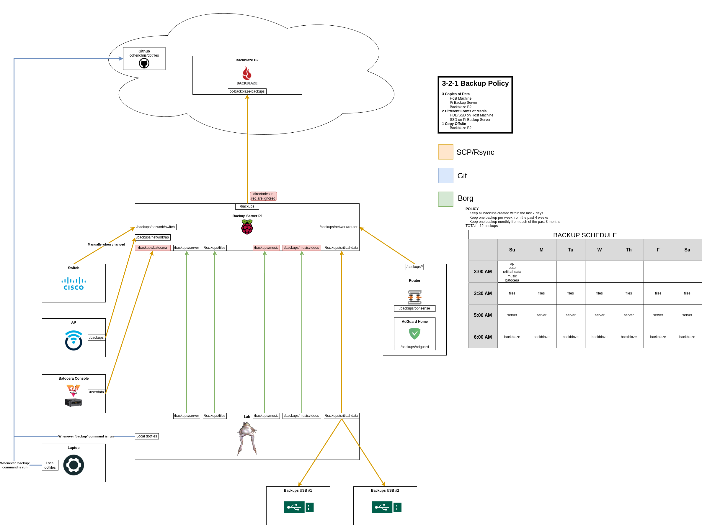

# Backups

Scripts which backup various devices and services.

Unless otherwise documented, each script will execute on the backup target machine and behave as follows:
1. Create a backup for the target data
2. Store one copy of the backup on the local machine
3. Store one copy of the backup on a remote backup server
4. Send an email with an overview of the job status

### Prerequisites and Use
Every script is data-driven using variables defined in the `.env` file.
A `sample.env` file is provided which should be cloned by running `cp sample.env .env`.
Each variable in the `.env` file is clearly labeled with the name of the script(s) it corresponds to.
If you attempt to run a script without all of the relevant variables filled in, an error message will be printed and execution will stop.

These scripts are customized to my exact network structure and backup requirements, each constructed using common functions defined in `common.sh`.

I follow the "3-2-1 backup system", which calls for:
- **3** copies of your data
- On **2** different storage mediums (e.g. 1 copy on an HDD, one copy on an SSD)
- With **1** copy stored offsite

This diagram is a visual representation of how I use these scripts to construct a completely automated, redundant, and extensible backup system in my own home.
Note that the backups are staggered to prevent conflicting operations and data corruption.



In this document, you will see references to "local machine" and "backup server".

Taking the above diagram as an example, "local machine" refers to the device on which the backup script is run.
"Backup server" refers to the central figure labeled "Backup Server Pi" in the diagram.
This is a single device on my network that stores backups for my entire network.


# Table of Contents

  - [Prerequisites and Use](#Prerequisites-and-Use)
- [Backblaze Remote Backup](#Backblaze-Remote-Backup)
  - [Prerequisites](#Prerequisites)
  - [Use](#Use)
- [Switch Backup](#Switch-Backup)
- [Batocera Console Backup](#Batocera-Console-Backup)
  - [Prerequisites](#Prerequisites)
  - [Use](#Use)
- [Common Backup Functions](#Common-Backup-Functions)
  - [Use](#Use)
- [Critical Data Backup](#Critical-Data-Backup)
  - [Prerequisites](#Prerequisites)
  - [Use](#Use)
- ["Cloud" Files Backup](#"Cloud"-Files-Backup)
  - [Prerequisites](#Prerequisites)
  - [Use](#Use)
- [Critical Data Backup - 2x Manual USB Cold Backup](#Critical-Data-Backup---2x-Manual-USB-Cold-Backup)
  - [Prerequisites](#Prerequisites)
  - [Use](#Use)
- [Music Backup](#Music-Backup)
  - [Prerequisites](#Prerequisites)
  - [Use](#Use)
- [OpenWRT Backup](#OpenWRT-Backup)
  - [Prerequisites](#Prerequisites)
  - [Use](#Use)
- [OPNSense + AdGuard Backup](#OPNSense-+-AdGuard-Backup)
  - [Prerequisites](#Prerequisites)
  - [Use](#Use)
- [Server Backup](#Server-Backup)
  - [Prerequisites](#Prerequisites)
  - [Use](#Use)
- [Interacting With Borg](#Interacting-With-Borg)
  - [Resources:](#Resources:)


## Backblaze Remote Backup
[`backblaze.sh`](backblaze.sh)

This script backs up a single directory to a remote Backblaze B2 bucket.
Think of this as fulfilling the "1" in "3-2-1 backup system".

### Prerequisites
- Backblaze CLI package is installed
- Variables for this script are filled out in [`.env`](sample.env) file
- The Backblaze CLI package has an authorized Backblaze account under the root user named `backblaze`
- `msmtp` and `mutt` packages are installed and configured under the root user

### Use
This script is intended to periodically sync a backups directory to one Backblaze bucket.
I recommend scheduling it as a cron job.

This script will have conflicts with **every** other script in this directory.
Please ensure that there are ZERO backups in-progress before running this script.


## Switch Backup
[`backup-switch.cmd`](backup-switch.cmd)

This script is a unique case.
I have a Cisco SG300-28PP, which is unable to execute cron jobs.
I don't update the switch very often, so I only back it up when I happen to change some settings.
The command present should be run on the switch CLI.
When run, a backup will be sent directly to the backups server.
`<backup_server_ip>` should be replaced with the IP of your backup server, and `<date>` with the current date.


## Batocera Console Backup
[`batocera.sh`](batocera.sh)

[Batocera](https://batocera.org) is a custom Linux distribution tailored for console emulation.
All of the save data, configuration data, game downloads, and more are saved in `/userdata`.
This script is responsible for backing up this `/userdata` directory.
It is likely that the console will be shut off, so this script is responsible for first powering the console on, backing up the target directory, then powering it off.

Batocera is an immutable distribution, so this script cannot be run locally.
Instead, this should be run and scheduled on the central backup server.

### Prerequisites
- The backup server is able to wake the console with a wake-on-lan packet
- Variables for this script are filled out in [`.env`](sample.env) file
- `msmtp` and `mutt` packages are installed and configured under the root user

### Use
On the backup server, this script should be set up as a cron job.
Unless excluded with the `MAIN_BACKUPS_EXCLUDE_REGEX` variable in [`.env`](sample.env), this script will conflict with the main [`backblaze.sh`](backblaze.sh) backup script.


## Common Backup Functions
[`common.sh`](common.sh)

This script functions as a common library for all other backup scripts - it should **NEVER** be run from the command line.

### Use
To use from another script, please do the following:

```sh
source common.sh
```

Alternatively, [`.env`](sample.env) already contains this line, so you may also run:

```sh
source .env
```

Now, all of the functions declared in `common.sh` will be available for use.


## Critical Data Backup
[`critical-data.sh`](critical-data.sh)

This script compiles all of the most critical data that I own - data that I would need to restore my data in absolute worst-case scenarios, including:
- Mobile 2FA Authenticator Backup (already present in `CRITICAL_DATA_LOCAL_BACKUP_DIR`)
- Bitwarden Password Manager Backup (backed up when this script is run)
- Encrypted file including critical passwords and 2FA recovery codes (already present in `CRITICAL_DATA_LOCAL_BACKUP_DIR`)

It stores this data on both the backup server AND a directory in your nextcloud installation.

### Prerequisites
- Bitwarden CLI package is installed
- Variables for this script are filled out in [`.env`](sample.env) file
- The Bitwarden CLI package has an authorized Bitwarden account under the root user

### Use
On your local machine of choice, this script should be set up as a cron job.

Due to the Nextcloud facet of this script, it will conflict with [`server.sh`](server.sh)
Also, please do not run [`manual-usbs-critical-data.sh`](manual-usbs-critical-data.sh) during this script's execution - that script operates using the same directories that this script uses.


## "Cloud" Files Backup
[`files.sh`](files.sh)

The files for my Nextcloud installation are not stored in the container itself, but instead on a separate drive.
I pass this separate drive into my Nextcloud Docker container and mount as external storage.

This script is responsible for backing up that separate drive containing my files.

To prevent file corruption, Nextcloud will first be placed in maintenance mode.
Once file backup is complete, Nextcloud will be taken out of maintenance mode.

### Prerequisites
- Variables for this script are filled out in [`.env`](sample.env) file
- You are running a nextcloud Docker container named `nextcloud`
- `msmtp` and `mutt` packages are installed and configured under the root user

### Use
On the local machine running Nextcloud, this script should be set up as a cron job.

This script will conflict with [`critical-data.sh`](critical-data.sh).


## Critical Data Backup - 2x Manual USB Cold Backup
[`manual-usbs-critical-data.sh`](manual-usbs-critical-data.sh)

As part of my 3-2-1 backup system, I have 2x USB sticks in a fireproof safe with the very basics that I would need to restore backups in a worst-case-scenario.
This script is highly tailored to my exact [`critical-data.sh`](critical-data.sh) backup structure and contents.

### Prerequisites
- Variables for this script are filled out in [`.env`](sample.env) file
- 2 devices are plugged into your local machine which the backup data will be copied to

### Use
This script should **NOT** be run as a cron job.
Instead, it should be run manually at consistent intervals.
Personally, I run this once per month.
The USB drives that I use for this are placed into a fireproof safe.

Please do not run [`critical-data.sh.sh`](critical-data.sh) during this script's execution - that script operates using the same directories that this script uses.


## Music Backup
[`music.sh`](music.sh)

I have a pretty large collection of music that I have accumulated over the years.
It would be very time-consuming and difficult to restore these files, so I have created a backup script dedicated to this.

### Prerequisites
- Variables for this script are filled out in [`.env`](sample.env) file
- You are running a Lidarr Docker container named `lidarr`
- `msmtp` and `mutt` packages are installed and configured under the root user

### Use
On the local machine where your music is stored, this script should be set up as a cron job.

This script does not conflict with any other script in this directory.


## OpenWRT Backup
[`openwrt.sh`](openwrt.sh)

I have flashed OpenWRT on my AP, and this script backs up the current configuration.

### Prerequisites
- Variables for this script are filled out in [`.env`](sample.env) file
- You are running this on a machine running OpenWRT
- `msmtp` and `mutt` packages are installed and configured under the root user

### Use
On your OpenWRT AP, this script should be set up as a cron job.


## OPNSense + AdGuard Backup
[`opnsense.sh`](opnsense.sh)

My OPNSense router uses AdGuard Home for DNS-level adblocking.
This script backs up the current OPNSense and AdGuard configurations.

### Prerequisites
- Variables for this script are filled out in [`.env`](sample.env) file
- You are running this on a machine running OPNSense
- Your OPNSense machine is running AdGuardHome
- `msmtp` and `mutt` packages are installed and configured under the root user


### Use
On your OPNSense router, this script should be set up as an OPNSense action, which is essentially a cron job.
OPNSense actions are used because OPNSense may overwrite cron jobs manually defined using `crontab`.

To set up an action which runs this script, please refer to the [OPNSense system services directory](../os/services/opnsense).


## Server Backup
[`server.sh`](server.sh)

On my main server, I run a large stack of Docker containers using docker-compose.
This script backs up all of the configuration files for these Docker containers.

If I ever need to restore my configuration, I can simply extract a backup from this archive and run `docker-compose up -d` in the extracted directory!

### Prerequisites
- Variables for this script are filled out in [`.env`](sample.env) file
- You are running your server services with a docker-compose stack
- You are running a Plex Docker container named `plex`
- `msmtp` and `mutt` packages are installed and configured under the root user

### Use
On the local machine running your docker-compose stack, this script should be set up as a cron job.


---


## Interacting With Borg
To list the backups present in a borg archive store, run the following:

```sh
sudo borg mount /path/to/borg/repository::<backup_name> /path/to/mountpoint
```

To extract a given borg backup into the current directory, run the following:

```sh
sudo borg extract /path/to/borg/repository::<backup_name>
```

To mount a given borg backup to a specified mount point and view the backup without fully extracting, run the following:

```sh
sudo borg mount /path/to/borg/repository::<backup_name> /path/to/mountpoint
```

### Resources:
- [Backup with Borg](https://jstaf.github.io/2018/03/12/backups-with-borg-rsync.html)
